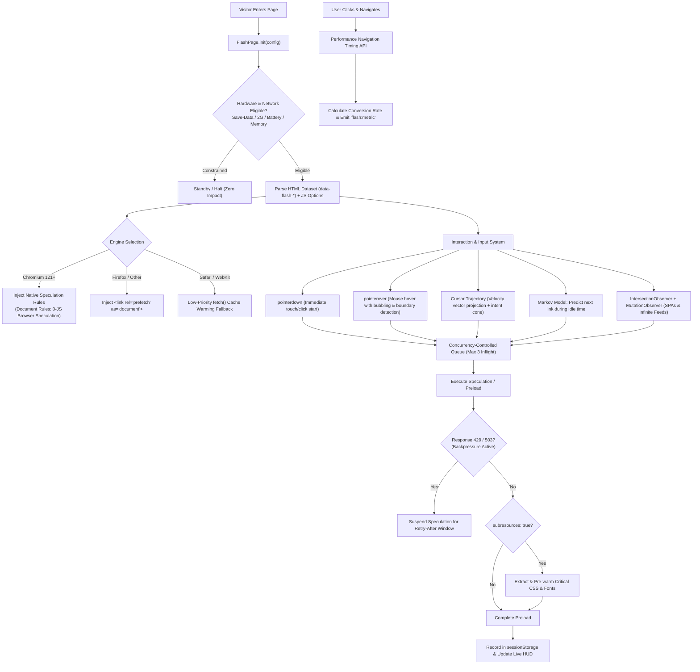

# Flash Page (v1.0.0)

[](./LICENSE)
[](#development-building--testing)
[-informational.svg)](#universal-distribution-tiers-full-vs-lite)
[-informational.svg)](#universal-distribution-tiers-full-vs-lite)
[](#modular-source-architecture-src)
[-success.svg)](#modular-source-architecture-src)

> **Make your site’s pages load instantly.**  
> *Smart prefetching and Speculation Rules manager with trajectory prediction, in-browser DevTools HUD, and server backpressure protection.*

---

## Table of Contents

- [How It Works](#how-it-works)
- [Core Web Vitals (CWV) & Safeguards](#core-web-vitals-cwv--safeguards)
- [Features at a Glance](#features-at-a-glance)
- [Detailed System Architecture](#detailed-system-architecture)
- [Modular Source Architecture (`src/`)](#modular-source-architecture-src)
- [Universal Distribution: Full vs. Lite](#universal-distribution-full-vs-lite)
- [Drop-In Migration from instant.page](#drop-in-migration-from-instantpage)
  - [Feature Comparison: instant.page vs. Flash Page](#feature-comparison-instantpage-vs-flash-page)
- [Quick Start by Platform](#quick-start-by-platform)
  - [Plain HTML / Static Sites](#1-plain-html--static-sites)
  - [WordPress](#2-wordpress)
  - [Shopify](#3-shopify)
  - [Laravel / Blade & Django / Jinja](#4-laravel--blade--django--jinja)
  - [NPM & Modern Bundlers (Vite / Next.js / Astro)](#5-npm--modern-bundlers-vite-webpack-nextjs-nuxt-astro)
- [In-Browser DevTools HUD (`Ctrl + Shift + F`)](#in-browser-devtools-hud)
- [Smart History-Based Navigation (Markov)](#smart-history-based-navigation-markov)
- [Server Backpressure & Health Protection (429 / 503)](#server-backpressure--health-protection)
- [Configuration Reference](#configuration-reference)
  - [Master Parameters Matrix (All 20 Options)](#master-parameters-matrix-all-20-options)
  - [Deep-Dive: Parameter Details & Behaviors](#deep-dive-parameter-details--behaviors)
  - [Per-Link Overrides & Safety Attributes](#per-link-overrides--safety-attributes)
- [Complete Programmatic API & TypeScript Reference](#complete-programmatic-api--typescript-reference)
- [Framework Integration (React, Vue 3, HTMX, Turbo)](#framework-integration)
- [Browser Support Matrix](#browser-support-matrix)
- [Development, Building & Testing](#development-building--testing)
- [License & Legal Attribution](#license--legal-attribution)

---

## How It Works

Before a visitor clicks a link, they hover their mouse over it, tap it on a touchscreen, or move the cursor directly toward it. This creates a natural **100–300 ms** gap between user intent and the click event.

**Flash Page** uses this brief window to preload or prerender the destination page. By the time the user clicks, the target document is already warm in the browser cache, rendering almost instantaneously and noticeably improving Core Web Vitals (LCP, INP).

---

## Core Web Vitals (CWV) & Safeguards

Flash Page is designed to speed up page transitions without eating up main thread time or wasting user bandwidth:

| Metric | Target | Real-World Impact with Flash Page | How It Helps |
| :--- | :---: | :---: | :--- |
| **LCP** (Largest Contentful Paint) | `< 2.5s` | 🚀 **50%–90% Faster** | Destination HTML and critical CSS/fonts are pre-cached before click. Subsequent TTFB drops to **~0–15ms**. |
| **INP** (Interaction to Next Paint) | `< 200ms` | 🟢 **Zero Degradation** | Uses `passive: true` listeners to keep scrolling smooth. Speculation Rules execute out-of-process in the browser network thread. |
| **CLS** (Cumulative Layout Shift) | `< 0.1` | 🛡️ **0.000 (Unaffected)** | Operates entirely in the background via head tags, causing zero layout shifting. |
| **TTFB** (Time to First Byte) | `< 800ms` | ⚡ **Instant (~0–15ms)** | Target pages load directly from memory or HTTP cache on click. |

### Built-in Bandwidth & Battery Safeguards:
1. **Low Network Priority**: All speculative requests use `fetchPriority: 'low'` so current page images, fonts, and API requests always take priority.
2. **Concurrency Limits**: Caps active background network connections to `maxConcurrent: 3`.
3. **Data Saver & 2G Detection**: Pauses prefetching when `Save-Data` is turned on or when the user is on a slow 2G connection.
4. **Battery Awareness**: Automatically pauses prefetching when the device battery drops below 20% while discharging.
5. **Memory Limits**: Skips speculation on low-memory mobile devices ($\le 1\text{ GB}$).
6. **Server Backpressure**: Backs off for 30s+ on HTTP `429` (Too Many Requests) or `503` (Service Unavailable) based on `Retry-After`.

---

## Features at a Glance

* **⚡ Native Speculation Rules**: In modern Chromium browsers (Chrome/Edge 121+), Flash Page inserts declarative document rules, letting the browser engine speculate natively in C++ with zero JavaScript overhead during navigation.
* **🧠 Smart History-Based Navigation**: Learns common navigation transitions locally in `localStorage` ($< 1\text{ KB}$, no server calls) to prefetch likely next destinations during browser idle time (`requestIdleCallback`).
* **🖥️ In-Browser DevTools HUD (`Ctrl + Shift + F`)**: A small overlay on the bottom right showing live engine mode, queue depth, server health, and glowing highlights on preloaded links.
* **🛡️ Server Backpressure & 429/503 Protection**: Reads `Retry-After` response headers on 429 or 503 responses, pausing prefetching site-wide during high-traffic spikes to protect your server.
* **🎯 Modern Pointer Events**: Clean `pointerover` and `pointerdown` with hardware type detection (`event.pointerType`) and bubbling boundary detection, eliminating legacy touch/mouse timing workarounds.
* **🧭 Cursor Trajectory & Proximity Cone**: Calculates mouse velocity vectors across a 3-point proximity cone to prefetch links before the cursor even finishes moving to them.
* **🎨 Critical CSS & Font Warming**: Extracts critical stylesheets and web fonts from prefetched HTML and warms them into cache ahead of navigation.
* **🍏 Safari / WebKit Cache Warming**: Low-priority `fetch()` warming fallback for same-origin routes where document prefetch isn't supported.
* **🔒 Privacy & Action Safeguards**:
  * Honors `Save-Data`, 2G mobile networks, low battery ($< 20\%$), and low device memory.
  * Automatically ignores `[download]` links, `[rel~="nofollow"]`, `[data-method]`, `[hx-*]`, and destructive action routes (`/logout`, `/delete`, `/destroy`, `/remove`).
* **🔄 Dynamic SPAs & Infinite Feeds**: Built-in `MutationObserver` automatically catches newly added links in React, Vue, Svelte, HTMX, and Turbo apps.
* **📊 Conversion Telemetry**: Real-time measurement of prefetch hit rates and navigation timing.

---

## Detailed System Architecture



---

## Modular Source Architecture (`src/`)

Flash Page is built with **100% Pure Vanilla JavaScript (Native ES Modules)** under `src/`, with zero build-tool lock-in:

```
flash-page/
├── src/                          # 100% Pure Vanilla JS Source Modules
│   ├── config.js                 # Configuration state, dataset parser, and environment guards
│   ├── engines.js                # Speculation Rules (Document Rules), Link prefetch, Safari fetch
│   ├── guards.js                 # isPreloadable(), getAnchorHref(), action filters, nofollow, sensitive paths
│   ├── queue.js                  # Concurrency limiter & inflight request manager
│   ├── input.js                  # Pointer events, trajectory & intent cone physics
│   ├── viewport.js               # IntersectionObserver & dynamic SPA MutationObserver
│   ├── markov.js                 # Client-side Markov predictive navigation model
│   ├── subresources.js           # Critical CSS stylesheet & font preload extractor
│   ├── hud.js                    # In-browser DevTools HUD overlay & glowing link styles
│   ├── telemetry.js              # Performance Navigation Timing & conversion metrics
│   ├── framework-utils.js        # React hook (useFlashPage) & Vue directive (vFlash)
│   ├── index.js                  # Full bundle entrypoint
│   └── index-lite.js             # Lite bundle entrypoint (omits HUD, AI, & subresources)
├── flashpage.js                  # Standalone Vanilla JS full bundle (39.8 KB unminified, 4-space formatted)
├── flashpage.min.js              # Minified full bundle (27.0 KB, ~8.1 KB gzip)
├── flashpage.lite.js             # Standalone Vanilla JS lite bundle (30.0 KB unminified, 4-space formatted)
├── flashpage.lite.min.js         # Minified lite bundle (20.3 KB, ~5.9 KB gzip)
├── flashpage.d.ts                # TypeScript definition file for full bundle & root export
├── flashpage.lite.d.ts           # Dedicated TypeScript definition file for flash-page/lite
├── scripts/
│   └── build.js                  # Zero-dependency modular bundler & token-safe compact minifier
└── test/
    ├── comprehensiveTests.js     # 75 automated lifecycle, AI, dataset & unit tests
    ├── masterParametersTests.js  # 20 Master Parameters Matrix unit tests
    ├── unitTests.js              # 11 fast standalone unit tests
    └── bundleTests.js            # Bundle integrity, export parity & runtime smoke tests
```

---

## Universal Distribution: Full vs. Lite

| Feature | Full Bundle (`flashpage.js`) | Lite Bundle (`flashpage.lite.js`) |
| :--- | :---: | :---: |
| **Native Speculation Rules (Document Rules)** | ✅ | ✅ |
| **Pointer Events (`pointerover` / `pointerdown`)** | ✅ | ✅ |
| **Safari / WebKit `fetch()` Fallback** | ✅ | ✅ |
| **Hardware & Privacy Guards (`Save-Data`, 2G, Battery, Memory)** | ✅ | ✅ |
| **Security Filters (`download`, `rel="nofollow"`, `/logout`, `/delete`)** | ✅ | ✅ |
| **Dynamic SPAs (`MutationObserver` + `IntersectionObserver`)** | ✅ | ✅ |
| **Cursor Trajectory & Intent Cone** | ✅ | ✅ |
| **Server Backpressure (429/503 Auto-Backoff)** | ✅ | ✅ |
| **Smart History Navigation (Markov)** | ✅ | ❌ |
| **In-Browser DevTools HUD (`Ctrl + Shift + F`)** | ✅ | ❌ |
| **Subresource Critical CSS/Font Pre-warming** | ✅ | ❌ |
| **React Hook (`useFlashPage`) & Vue 3 Directive (`vFlash`)** | ✅ | ❌ |
| **TypeScript Definitions** | [`flashpage.d.ts`](./flashpage.d.ts) | [`flashpage.lite.d.ts`](./flashpage.lite.d.ts) |
| **Unminified File Size** | **39.8 KB** | **30.0 KB** |
| **Minified File Size** | **27.0 KB** *(~8.1 KB gz)* | **20.3 KB** *(~5.9 KB gz)* |
| **Best For** | E-commerce, SaaS, larger web apps | Lightweight blogs, news media, portfolio sites |

Both bundles are **100% standalone Vanilla JavaScript** with **zero runtime dependencies** and run directly in any modern browser without requiring node or transpilers.

---

## Drop-In Migration from `instant.page`

Upgrading existing websites from `instant.page` to **Flash Page** is **100% backward compatible** and needs **zero markup changes**:

1. **Drop-In Replacement**: Replace `instantpage.js` with `flashpage.min.js` (or `flashpage.lite.min.js`).
2. **Anchor Marker Compatibility**: Flash Page recognizes existing `data-instant` and `data-no-instant` link attributes alongside modern `data-flash` and `data-no-flash`.
3. **Dataset Parameter Fallbacks**: Existing body configuration attributes (`data-instant-intensity`, `data-instant-whitelist`, `data-instant-allow-query-string`, `data-instant-allow-external-links`) continue to work automatically.
4. **Instant Upgrade**: You immediately get modern Speculation Rules (Chrome 121+), Safari `fetch()` warming, Server Backpressure (429/503 protection), In-Browser DevTools HUD, and history-based prefetching.

### Feature Comparison: `instant.page` vs. `Flash Page`

| Feature / Capability | `instant.page` (v5.2.0) | `Flash Page` (v1.0.0) | Architectural Advantage |
| :--- | :---: | :---: | :--- |
| **Native Speculation Rules (Document Rules)** | ❌ | ✅ | Zero-JS browser-level speculation in Chrome/Edge 121+ |
| **Prerender Engine (Full Background Rendering)** | ❌ | ✅ | Instant page display with pre-executed scripts & styles |
| **Standard `<link rel="prefetch">` Support** | ✅ | ✅ | Universal fallback across Firefox and older Chromium |
| **Safari / WebKit Low-Priority `fetch()` Warming** | ❌ | ✅ | Safari ignores document prefetch; Flash Page warms WebKit cache |
| **Mouse Hover Delay Detection** | ✅ *(65ms)* | ✅ *(65ms)* | Full support with bubbling `pointerover` & boundary detection |
| **Touch / Click Start (`pointerdown`)** | ✅ | ✅ | Differentiates hardware pointer types (`event.pointerType`) |
| **Cursor Velocity & Intent Cone Prediction** | ❌ | ✅ | Vector projection prefetches links before mouse even lands |
| **Smart History Navigation (Markov Model AI)** | ❌ | ✅ | Learns user journeys locally ($<1\text{ KB}$, no server calls) |
| **Viewport Prefetching with Rapid Scroll Guard** | ⚠️ *(Basic)* | ✅ | Pauses prefetching during rapid scrolling to preserve bandwidth |
| **Critical Subresource Pre-warming (CSS & Fonts)** | ❌ | ✅ | Discovers & warms stylesheets and web fonts ahead of navigation |
| **Concurrency-Controlled Queue Throttling** | ❌ | ✅ | Caps concurrent requests (default 3) to prevent socket congestion |
| **Server Backpressure Protection (HTTP 429 / 503)** | ❌ | ✅ | Reads `Retry-After` headers and pauses prefetching automatically |
| **Battery Level Guard ($<20\%$ & Discharging)** | ❌ | ✅ | Battery API integration prevents battery drain on mobile |
| **Device Memory Guard ($\le 1\text{ GB}$ RAM)** | ❌ | ✅ | Skips preloading on low-spec hardware to prevent browser lag |
| **Data Saver (`Save-Data`) & 2G Network Guard** | ✅ | ✅ | Automatically respects user privacy and metered bandwidth |
| **Destructive Action URL Protection** | ❌ | ✅ | Auto-ignores `/logout`, `/delete`, `/destroy`, `/remove` |
| **Modern Action Attribute Filters** | ❌ | ✅ | Automatically filters `[data-method]`, `[hx-*]`, `[data-turbo-method]` |
| **Target Exclusion (`target="_blank"`)** | ❌ | ✅ | Skips new-tab links in both JS and native Speculation Rules |
| **Dynamic SPAs (`MutationObserver`)** | ❌ | ✅ | Automatically captures newly mounted links in React, Vue, HTMX |
| **React Hook (`useFlashPage`) & Vue Directive (`vFlash`)** | ❌ | ✅ | First-class framework integration utilities included |
| **In-Browser DevTools HUD (`Ctrl + Shift + F`)** | ❌ | ✅ | Real-time visual overlay, queue depths & glowing link highlights |
| **Real-Time Conversion Telemetry (`flash:metric`)** | ❌ | ✅ | Performance Navigation Timing API integration & hit-rate metrics |
| **Programmatic API (`preload()`, `destroy()`, `status()`)** | ❌ | ✅ | Full runtime JavaScript API control for programmatic navigation |
| **TypeScript Type Declarations (`.d.ts`)** | ❌ | ✅ | Complete type safety for TypeScript & modern bundler projects |
| **Drop-In Compatibility with `data-instant-*`** | N/A | ✅ | 100% backward compatible without modifying existing markup |
| **External Dependencies** | 0 | 0 | 100% Pure Vanilla JavaScript, zero build or runtime lock-in |

---

## Quick Start by Platform

### 1. Plain HTML / Static Sites
Add the script tag right before your closing `</body>` tag:
```html
<!-- Full Bundle with DevTools HUD & History Navigation -->
<script src="/flashpage.min.js" type="module"></script>

<!-- OR Lightweight Lite Bundle (~3 KB) -->
<script src="/flashpage.lite.min.js" type="module"></script>
```

### 2. WordPress
Add this single line to your active theme’s `functions.php`:
```php
function add_flash_page() {
    wp_enqueue_script('flash-page', get_template_directory_uri() . '/flashpage.min.js', array(), '1.0.0', true);
}
add_action('wp_enqueue_scripts', 'add_flash_page');
```

### 3. Shopify
In your Shopify theme, open `layout/theme.liquid` and paste this right above `</body>`:
```liquid
<script src="{{ 'flashpage.min.js' | asset_url }}" type="module"></script>
```

### 4. Laravel / Blade & Django / Jinja
In your base layout template:
```html
<script src="{{ asset('js/flashpage.min.js') }}" type="module"></script>
```

### 5. NPM & Modern Bundlers (Vite, Webpack, Next.js, Nuxt, Astro)
Install the package:
```bash
npm install flash-page
```

Import and initialize programmatically:
```javascript
// Full package
import { init, preload, toggleHUD } from 'flash-page'

init({
    intensity: 65,            // 65ms hover delay, or 'viewport' | 'mousedown' | 'predictive'
    predictive: true,         // Enable cursor trajectory & proximity projection
    markov: true,             // Enable history-based next page speculation
    subresources: true,       // Pre-warm critical CSS and fonts
    backpressure: true,       // Auto-pause on HTTP 429/503
    hud: false,               // DevTools HUD (toggle anytime with Ctrl+Shift+F)
    onPreload: (url, engine) => console.log(`[FlashPage] ${url} via ${engine}`),
    onMetric: (metric) => console.log('[FlashPage] Telemetry:', metric)
})

// Programmatically preload a specific route
preload('/pricing', 'high')
```

Or import the lite bundle:
```javascript
import { init, preload } from 'flash-page/lite'

init({ intensity: 'predictive' })
```

---

## In-Browser DevTools HUD

Press **`Ctrl + Shift + F`** (or **`Cmd + Shift + F`** on macOS) anywhere on your website to toggle the live DevTools HUD:

* **Engine Indicator**: Displays active browser engine (`document-rules`, `speculation-list`, `link`, or `fetch`).
* **Queue Monitor**: Displays real-time preloaded count, active in-flight requests, and queue depth.
* **Server Health**: Displays **Normal** or **Backpressure** status based on server response codes.
* **Visual Glow**: Links light up with a glowing cyan outline (`data-flash-highlighted="true"`) when speculated.
* **Zero Dependency & Safe Close**: Features a self-contained close button with complete DOM and style element teardown.

You can also force the HUD open on startup using HTML attributes:
```html
<body data-flash-hud>
```

---

## Smart History-Based Navigation (Markov)

Flash Page includes a lightweight, client-only navigation transition tracker stored in `localStorage` ($< 1\text{ KB}$):

1. **Records Transitions**: When a visitor navigates from `/blog` to `/blog/first-post`, Flash Page logs the path transition locally in `localStorage['flash_markov']`.
2. **Idle-Time Lookup**: When a visitor lands on a page, Flash Page checks these past transition patterns during browser idle time (`requestIdleCallback`).
3. **Smart Speculation**: If a destination has a frequent transition pattern ($\ge 60\%$ probability with at least 3 historical visits), Flash Page preloads that link ahead of time.

---

## Server Backpressure & Health Protection

To prevent aggressive prefetching from stressing backend servers or triggering IP rate-limits:

1. **Automatic Response Inspection**: If a prefetch request receives an HTTP `429 Too Many Requests` or `503 Service Unavailable`, Flash Page reads the `Retry-After` header (default: 30s).
2. **Site-Wide Suspension**: All background prefetching across the site is suspended until the backpressure window expires.
3. **HUD Feedback**: The DevTools HUD immediately displays `● Backpressure` in red.
4. **Health Guard**: `isServerHealthy()` returns `false` during backpressure, preventing new network requests.

---

## Configuration Reference

You can configure Flash Page either via **JavaScript `init(options)`** or declaratively via **HTML `data-*` attributes** on `<body>`.

### Master Parameters Matrix (All 20 Options)

| Parameter (`FlashPageConfig`) | Type / Allowed Values | Default | HTML Dataset Attribute | Description |
| :--- | :--- | :---: | :--- | :--- |
| `intensity` | `'mousedown'` \| `'mousedown-only'` \| `'viewport'` \| `'viewport-all'` \| `'predictive'` \| `number` | `65` | `data-flash-intensity` | Strategy & threshold for preloading. A number specifies hover delay in ms. |
| `delayOnHover` | `number` (ms) | `65` | `data-flash-delay-on-hover` | Explicit hover duration threshold in milliseconds before initiating preload. |
| `allowQueryString` | `boolean` | `false` | `data-flash-allow-query-string` | Enables preloading URLs containing query parameters (e.g., `/search?q=test`). |
| `allowExternalLinks` | `boolean` | `false` | `data-flash-allow-external-links` | Enables preloading external cross-origin links. |
| `whitelist` | `boolean` | `false` | `data-flash-whitelist` | Only preloads links that carry an explicit `data-flash` attribute. |
| `specrules` | `'prefetch'` \| `'prerender'` \| `'no'` | `'prefetch'` | `data-flash-specrules` | Speculation Rules mode: native Chromium prefetch, full prerender, or bypass. |
| `predictive` | `boolean` | `false` | `data-flash-predictive` | Enables cursor velocity trajectory projection to preload before hover. |
| `intentCone` | `boolean` | `true` | `data-flash-no-intent-cone` *(negated)* | Expands velocity trajectory into a 3-point intent cone for diagonal targeting. |
| `respectDataSaver` | `boolean` | `true` | `data-flash-no-data-saver` *(negated)* | Automatically disables preloading if `Save-Data` or 2G network is detected. |
| `respectBattery` | `boolean` | `true` | `data-flash-no-battery` *(negated)* | Automatically disables preloading if battery level is below 20% and discharging. |
| `safariFallback` | `boolean` | `true` | `data-flash-no-safari-fallback` *(negated)* | Uses low-priority `fetch()` cache warming fallback on WebKit / Safari. |
| `maxConcurrent` | `number` | `3` | `data-flash-max-concurrent` | Maximum concurrent in-flight speculative network requests. |
| `subresources` | `boolean` | `false` | `data-flash-subresources` | Parses prefetched HTML to pre-warm linked critical stylesheets and web fonts. |
| `markov` | `boolean` | `true` | `data-flash-no-markov` *(negated)* | Learns page transitions in `localStorage` to speculate next pages during idle time. |
| `backpressure` | `boolean` | `true` | `data-flash-no-backpressure` *(negated)* | Pauses prefetching site-wide on HTTP 429/503 responses based on `Retry-After`. |
| `debug` | `boolean` | `false` | `data-flash-debug` | Enables verbose diagnostic logging in browser developer console. |
| `hud` | `boolean` | `false` | `data-flash-hud` | Forces the DevTools HUD overlay to be open on startup (`Ctrl+Shift+F`). |
| `filter` | `(url: URL, anchor: HTMLAnchorElement) => boolean` | `null` | *(JS only)* | Custom predicate function to dynamically allow or reject specific links. |
| `onPreload` | `(url: string, engine: string) => void` | `null` | *(JS only)* | Lifecycle callback fired whenever a URL prefetch/prerender is dispatched. |
| `onMetric` | `(metric: FlashPageMetric) => void` | `null` | *(JS only)* | Performance callback receiving conversion timing and transfer metrics. |

---

### Deep-Dive: Parameter Details & Behaviors

#### 1. `intensity`
Controls **how and when** links are preloaded:
- **`number` (default `65`)**: Preloading starts after the user hovers over an anchor for this many milliseconds. 65ms filters out accidental cursor sweeps while keeping navigation instant.
- **`'mousedown'`**: Preloads immediately when the user presses mouse down (desktop) or taps down (touch devices). Eliminates the hover delay while guaranteeing intentionality.
- **`'mousedown-only'`**: Disables desktop mouse hover preloading entirely. Preloads strictly on `mousedown` and touch tap.
- **`'viewport'`**: Preloads visible links as they scroll into view (only on mobile/small viewports where total screen area $< 450,000\text{ px}^2$).
- **`'viewport-all'`**: Preloads visible links across all screens regardless of resolution.
- **`'predictive'`**: Evaluates mouse velocity and vector trajectory to preload target links **150–300ms before cursor hover occurs**.
- **`'intent-cone'`**: Extends velocity prediction into a 3-point directional intent cone, detecting destination links based on mouse heading angle and momentum.

#### 2. `specrules`
Configures Chrome/Edge 121+ native Speculation Rules:
- **`'prefetch'` (default)**: Downloads the document body and headers into the browser cache.
- **`'prerender'`**: Fully renders the target page and executes its JavaScript in a hidden background tab. When clicked, page activation is **0ms instantaneous**.
- **`'no'`**: Disables Speculation Rules entirely, falling back to standard `<link rel="prefetch">` or Safari `fetch()`.

#### 3. `subresources`
When set to `true`, Flash Page inspects the prefetched HTML document text for:
- `<link rel="stylesheet" href="...">`
- `<link rel="preload" as="font" href="...">`
It warms up to 4 critical stylesheets and web fonts into the browser cache, preventing render-blocking layout shifts when the destination page opens.

#### 4. `filter` (Custom Link Predicate)
Supply a custom function to enforce domain-specific rules:
```javascript
init({
    filter: (url, anchor) => {
        // Never prefetch admin routes
        if (url.pathname.startsWith('/admin')) return false
        // Never prefetch cart actions
        if (anchor.classList.contains('cart-btn')) return false
        return true
    }
})
```

---

### Per-Link Overrides & Safety Attributes

You can control behavior on individual links directly in your HTML:

| Attribute | Behavior | Example |
| :--- | :--- | :--- |
| `data-no-flash` / `data-no-instant` | **Blacklists** a link from being preloaded under any circumstances. | `<a href="/logout" data-no-flash>Sign Out</a>` |
| `data-flash` / `data-instant` | **Whitelists** a link (overrides whitelist mode and query-string restrictions). | `<a href="/pricing?plan=pro" data-flash>Upgrade</a>` |
| `data-flash-intensity="20"` | **Overrides hover delay** on a specific link (e.g. 20ms ultra-fast preload). | `<a href="/cart" data-flash-intensity="20">Cart</a>` |
| `target="_blank"` | Automatically ignored (browser new tab / isolated context). | `<a href="/terms" target="_blank">Terms</a>` |
| `download` | Automatically ignored (native browser file download). | `<a href="/report.pdf" download>Report</a>` |
| `rel="nofollow"` | Automatically ignored (search engine crawler exclusion). | `<a href="/ad" rel="nofollow">Sponsor</a>` |
| `data-method` / `hx-post` | Automatically ignored (prevents state-mutating requests in Rails/HTMX/Turbo). | `<a href="/item/1" hx-delete>Delete</a>` |

---

## Complete Programmatic API & TypeScript Reference

Flash Page provides first-class TypeScript definitions ([flashpage.d.ts](flashpage.d.ts)):

```typescript
import {
    init,
    preload,
    destroy,
    getMetrics,
    status,
    toggleHUD,
    isPreloadable,
    getAnchorHref,
    isServerHealthy,
    isEnvironmentEligible,
    setBackpressure,
    getConfig,
    setConfig,
    resetConfig,
    extractSubresources,
    recordTransition,
    predictNextLink,
    useFlashPage,
    vFlash
} from 'flash-page'

// 1. Initialize with custom options
init({ intensity: 'predictive', markov: true })

// 2. Programmatically Preload a URL
preload('/checkout', 'high')

// 3. Inspect Live Status
const currentStatus = status()
// => { initialized: true, engine: 'document-rules', preloadedCount: 14, inflightCount: 0, isHealthy: true }

// 4. Safely inspect an anchor href (handles SVG and custom elements)
const href = getAnchorHref(document.querySelector('a'))

// 5. Toggle DevTools HUD
toggleHUD()

// 6. Query Navigation Telemetry
const metrics = getMetrics()
// => [{ url: 'https://site.com/blog', converted: true, duration: 38, transferSize: 0 }]

// 7. Inspect or Predict Transitions
recordTransition('/pricing', '/signup')
const next = predictNextLink('/pricing') // => '/signup'

// 8. Manual Server Backpressure Control
setBackpressure(60) // Suspends speculation site-wide for 60s

// 9. Lifecycle Teardown (Removes all event listeners, observers & styles)
destroy()
```

### Window Event Hooks

Flash Page emits standard browser `CustomEvent` instances:

```javascript
// Fired when Flash Page engine is initialized and ready
window.addEventListener('flash:ready', (e) => {
    console.log('Ready with engine:', e.detail.status.engine)
})

// Fired on each prefetch attempt
window.addEventListener('flash:preload', (e) => {
    console.log('Preloaded:', e.detail.url, 'via', e.detail.engine)
})

// Fired when a preloaded navigation converts
window.addEventListener('flash:metric', (e) => {
    console.log('Conversion metric:', e.detail)
})
```

---

## Framework Integration

### React / Next.js
Use the built-in `useFlashPage` hook:
```jsx
import { useEffect } from 'react'
import { useFlashPage } from 'flash-page'

export default function Layout({ children }) {
    const { preload, status } = useFlashPage({
        predictive: true,
        markov: true,
    })

    return <div>{children}</div>
}
```

### Vue 3
Use the built-in `vFlash` directive:
```vue
<script setup>
import { vFlash } from 'flash-page'
</script>

<template>
    <!-- Preloads when mounted -->
    <a href="/dashboard" v-flash>Dashboard</a>

    <!-- Preloads custom URL -->
    <button v-flash="'/cart'">View Cart</button>
</template>
```

### HTMX / Turbo (Hotwire)
Flash Page automatically respects modern declarative HTML frameworks:
- **Action Protection**: Links with `[data-method]`, `[data-turbo-method]`, `[hx-post]`, or `[hx-delete]` are automatically excluded from prefetching to prevent accidental side-effect mutations.
- **Dynamic DOM Observation**: Dynamic content inserted via HTMX swaps or Turbo Streams is automatically observed by the built-in `MutationObserver`.

---

## Browser Support Matrix

| Browser Engine | Strategy Used | Network Impact |
| :--- | :--- | :--- |
| **Chromium 121+** (Chrome, Edge, Brave, Opera) | **Native Speculation Rules (Document Rules)** in browser C++ | Zero JS overhead, native browser speculation pipeline |
| **Chromium 100–120** | Speculation Rules (List-based) or Restrictive Link Prefetch | Native memory caching |
| **Firefox 115+** | Native `<link rel="prefetch">` + Pointer Events | Standard HTTP disk caching |
| **Safari / WebKit (macOS / iOS)** | Low-priority `fetch()` Cache Warming Fallback | WebKit memory & disk cache warming |

---

## Development, Building & Testing

### Run Complete Automated Test Suite (110+ Tests across 4 Suites)
```bash
npm test
```

### Run Master Parameters Matrix Tests (20 Parameters)
```bash
npm run test:matrix
```

### Run Fast Standalone Unit Tests
```bash
npm run test:unit
# or: node test/unitTests.js
```

### Run Distribution Bundle Integrity & Export Parity Tests
```bash
npm run test:bundles
```

### Run JavaScript Syntax & ESM Validation (`node --check`)
```bash
npm run check
```

### Interactive Live HTML Test Workbench
Flash Page includes a zero-dependency interactive visual testing workbench (`test/live-test.html`) for browser validation:
```bash
npm run test:live
# Open http://127.0.0.1:8085/live in your browser
```
Features included in the workbench:
- **Live Parameter Controls (All 20 Parameters)**: Adjust intensity (`65`, `120`, `300`, `mousedown`, `mousedown-only`, `viewport`, `viewport-all`, `predictive`, `intent-cone`), speculation rules engine (`prefetch`, `prerender`, `no`), concurrency caps, and all 12 feature flags on the fly.
- **17 Live Scenario Destination Pages**: Every link in the matrix connects to a real destination page showing live browser `PerformanceNavigationTiming` metrics (`Transfer Size: 0 bytes`, `Duration: 0-15 ms`) and a single-click return button.
- **Head DOM Inspector**: Watch dynamic `<script type="speculationrules">` JSON and `<link rel="prefetch">` tags inject and update in real-time.
- **Real-Time Event Stream**: Live terminal monitoring `flash:ready`, `flash:preload`, `flash:metric`, and backpressure state changes.
- **Mouse Trajectory Vectoring Pad**: Live testing zone with cursor coordinates, velocity (px/ms), heading angle, and real destination targets (`/target-alpha.html`, `/target-beta.html`, `/target-gamma.html`).
- **Interactive Concurrency & Burst Queue Testing**: Click "⚡ Test Burst Queue" to queue 6 URLs at once and watch the concurrency limiter (`Active / Queue`) throttle and release in-flight requests.
- **Programmatic Preload API Bar**: Test `preload(url, priority)` on demand with priority switches.
- **Server Backpressure Simulation**: Trigger an HTTP 429 response simulation with `Retry-After: 30` to verify automatic speculation pausing and countdown.
- **Automatic Port Fallback**: If port `8085` is in use, the test server automatically falls back to `8086`, `8087`, etc., without crashing.

### Build Universal Bundles (Full & Lite, Formatted & Minified)
```bash
npm run build
```

---

## License & Legal Attribution

### Primary License
**Flash Page** is licensed under the [GNU General Public License v3.0 (GPL-3.0-or-later)](./LICENSE).  
Copyright (C) 2026 Flash Page Contributors.

### Upstream Attribution
Flash Page is an enterprise-grade derivative work originally based on and inspired by [`instant.page`](https://instant.page/) created by Alexandre Dieulot:  
- **Original Work**: `instant.page` Copyright (C) 2019–2025 Alexandre Dieulot (Licensed under the [MIT License](./LICENSE)).
- Alexandre Dieulot's original MIT copyright notice and permission terms are preserved verbatim in the [`LICENSE`](./LICENSE) file in full compliance with open-source licensing laws.

### Non-Affiliation Disclaimer
Flash Page is an independent, community-driven project. It is **not** affiliated with, endorsed by, maintained by, or sponsored by Alexandre Dieulot or the original `instant.page` project. All trademarks and project names belong to their respective holders.
